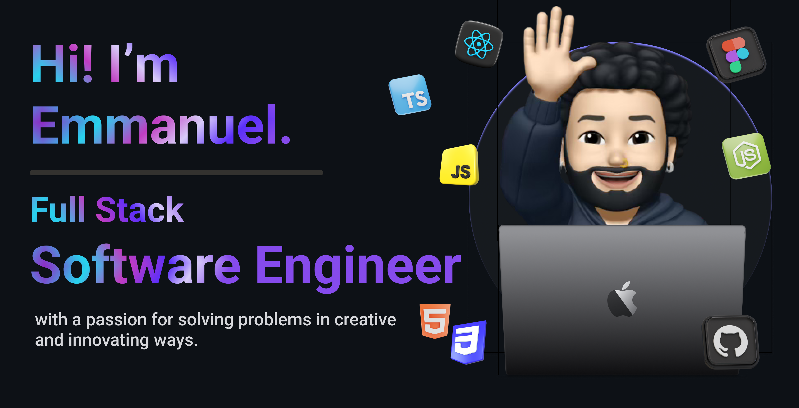

## About Me 🚀

I'm a **Full Stack Software Engineer** who enjoys building clean, production-ready web applications with a focus on great developer experience and solid architecture.

-   🌱 Currently learning: **npm workspaces, monorepo tooling, and build pipelines**
-   🔭 Working on: **Lucid — a personal game library tracker**
-   🌍 Languages: **JavaScript, TypeScript, English**
-   ⚡ Fun fact: **I built an entire app just to track my game backlog**

## My Skills 🧠

      

## Featured Projects 💻

### [Lucid](https://github.com/EmLopezDev/lucid)

**Lucid** is a full-stack personal game library tracker built with **React 19, TypeScript, Node.js, Express, and MongoDB**. Log games across five statuses — Playing, Completed, Paused, Dropped, and Wishlist — with ratings, hours played, price, and notes. Includes a dashboard with library stats, secure authentication with email verification, and account management. You can check out the repository [here](https://github.com/EmLopezDev/lucid).

## Get in Touch 📬

-   **LinkedIn**: [emmanuel-lopez](https://www.linkedin.com/in/emmanuel-lopez-a812b0127)
-   **Email**: [emlopezdev@gmail.com](mailto:emlopezdev@gmail.com)
